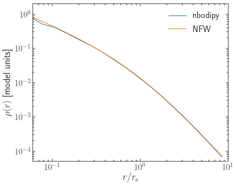
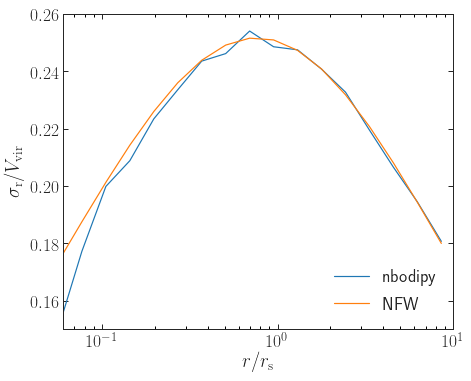

# nbodipy
Python implementation of Frank van den Bosch's N-body simulation IC generation code, which uses standard inverse transform sampling to sample particle locations and then samples the NFW distribution function of [Widrow (2000)](http://adsabs.harvard.edu/abs/2000ApJS..131...39W) using rejection sampling as described in [Kuijken \& Dubinski (1994)](http://dx.doi.org/10.1093/mnras/269.1.13).

